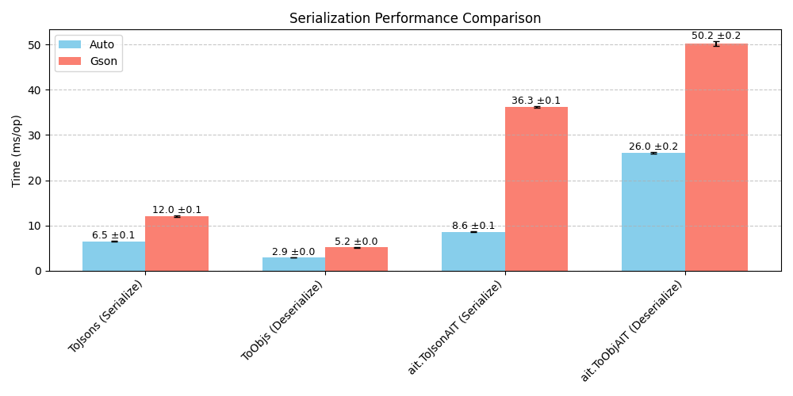

| Benchmark                             | Mode | Cnt |  Score |   Error | Units |
|---------------------------------------|:----:|:---:|-------:|--------:|-------|
| ToJsonBenchmarks.autoSerialize        | avgt | 10  |  6.487 | ± 0.054 | ms/op |
| ToJsonBenchmarks.gsonSerialize        | avgt | 10  | 12.033 | ± 0.159 | ms/op |
| ToObjBenchmarks.autoDeserialize       | avgt | 10  |  2.928 | ± 0.008 | ms/op |
| ToObjBenchmarks.gsonDeserialize       | avgt | 10  |  5.177 | ± 0.090 | ms/op |
| ait.ToJsonAITBenchmark.autoSerialize  | avgt | 10  |  8.621 | ± 0.060 | ms/op |
| ait.ToJsonAITBenchmark.gsonSerialize  | avgt | 10  | 36.254 | ± 0.182 | ms/op |
| ait.ToObjAITBenchmark.autoDeserialize | avgt | 10  | 25.977 | ± 0.194 | ms/op |
| ait.ToObjAITBenchmark.gsonDeserialize | avgt | 10  | 50.200 | ± 0.549 | ms/op |

(Ran x1000 times)
Benchmarked on [`3324422`](https://github.com/DrTheodor/autojson/commit/3324422f510756a800b1f4463c4f6535179fa006).

