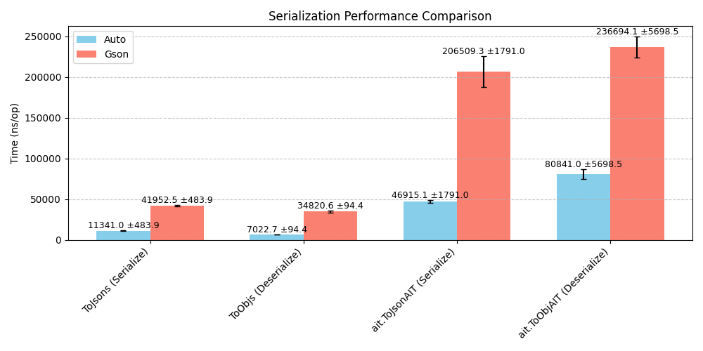
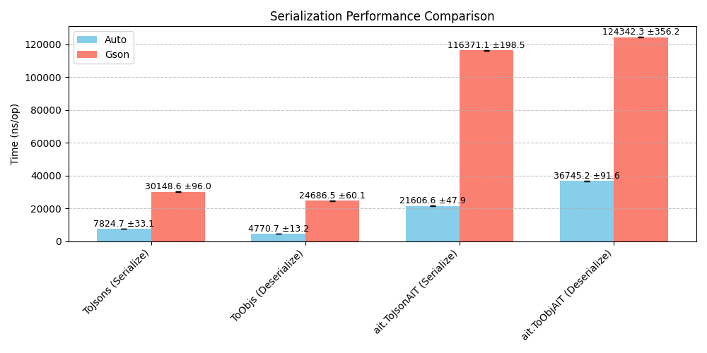

## My Laptop

> **Ran on**: Microsoft Surface Laptop
>
> **CPU**: Intel i5-7300U
>
> **RAM**: 8GB
>
> **OS**: Windows 10 Enterprise LTSC

| Benchmark                             | Mode | Cnt |      Score |       Error | Units |
|---------------------------------------|:----:|:---:|-----------:|------------:|-------|
| ToJsonBenchmarks.autoSerialize        | avgt | 10  |  11340.972 |   ± 483.899 | ns/op |
| ToJsonBenchmarks.gsonSerialize        | avgt | 10  |  41952.507 |   ± 564.717 | ns/op |
| ToObjBenchmarks.autoDeserialize       | avgt | 10  |   7022.748 |    ± 94.389 | ns/op |
| ToObjBenchmarks.gsonDeserialize       | avgt | 10  |  34820.648 |  ± 1616.649 | ns/op |
| ait.ToJsonAITBenchmark.autoSerialize  | avgt | 10  |  46915.092 |  ± 1791.029 | ns/op |
| ait.ToJsonAITBenchmark.gsonSerialize  | avgt | 10  | 206509.310 | ± 19026.570 | ns/op |
| ait.ToObjAITBenchmark.autoDeserialize | avgt | 10  |  80841.016 |  ± 5698.545 | ns/op |
| ait.ToObjAITBenchmark.gsonDeserialize | avgt | 10  | 236694.069 | ± 13047.773 | ns/op |

Benchmarked on [`18d5e30`](https://github.com/DrTheodor/autojson/commit/18d5e302f23f07b8b1070451f15ef67f0c52a609).

## GitHub Actions

> **Ran on**: GitHub Actions
>
> **OS**: ubuntu-latest

| Benchmark                             | Mode | Cnt |      Score |     Error | Units |
|---------------------------------------|:----:|:---:|-----------:|----------:|-------|
| ToJsonBenchmarks.autoSerialize        | avgt | 10  |   7919.078 |  ± 45.224 | ns/op |
| ToJsonBenchmarks.gsonSerialize        | avgt | 10  |  29124.129 |  ± 88.776 | ns/op |
| ToObjBenchmarks.autoDeserialize       | avgt | 10  |   6008.030 |  ± 13.492 | ns/op |
| ToObjBenchmarks.gsonDeserialize       | avgt | 10  |  24379.537 |  ± 47.092 | ns/op |
| ait.ToJsonAITBenchmark.autoSerialize  | avgt | 10  |  22505.071 |  ± 57.624 | ns/op |
| ait.ToJsonAITBenchmark.gsonSerialize  | avgt | 10  | 114119.449 | ± 197.695 | ns/op |
| ait.ToObjAITBenchmark.autoDeserialize | avgt | 10  |  31627.335 |  ± 40.339 | ns/op |
| ait.ToObjAITBenchmark.gsonDeserialize | avgt | 10  | 123578.704 | ± 270.685 | ns/op |

Benchmarked on [`4e40fa8`](https://github.com/DrTheodor/autojson/commit/4e40fa8c7a779d4bdd3feae314f80f0785ecb827).
